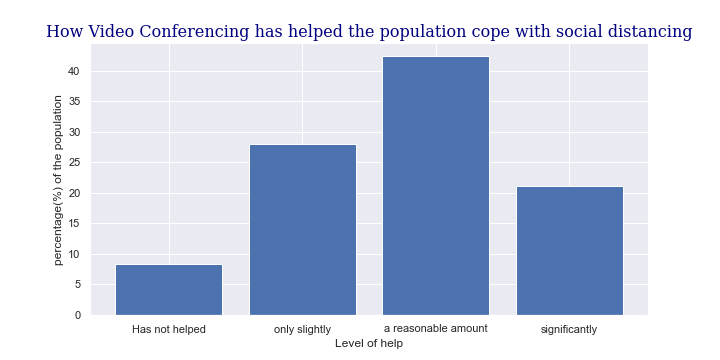

# About me:
My name is Carolina Krawczyk.
I am a Data Scientist with AI specialisation.  I have a MSc in Data Science and AI with Distinction from the [University of London](https://london.ac.uk/msc-data-science-and-artificial-intelligence-structure) I have a strong interest in AI, Neural Networks, Machine Learning and Blockchain.

* Strong analytical and quantitative background.
* Originally from Argentina, academically educated in Israel and in the UK.
* Degrees: MSc Data Science and AI with distinction, BSc. Biotechnology Engineering.
* +6 months experience as Data Scientist in a software company 
*  +9 years experience in chemical industries, mainly within the Renewable Energy sector.
*  +6 years UK-based professional. 
*  Awards: 
    *  My Data Science project I carried out on my last job was selected to be presented at an internal science conference, which I presented in June 2021  
    *  I won the scholarship "Green Campus" for my BSc Final Project in biodiesel production from waste. 
    *  I was a National Finalist in Mathematical Olympiads in Argentina.

# My Projects:
## Table of Contents:
* Project 1: Statistical and Rheological Analysis to Improve the Product Quality
* Project 2: Multi-Label Classification of Fashion Articles Images
* Project 3: Sentiment Analysis on Tourist Accommodation Reviews
* Project 4: Wine Quality Predictor
* Project 5: Life-Saving Decision Support System
* Project 6: Blockchain Development
* Project 7: Influence Of Video Conferences
* Project 8: My Own Implementation of K-Nearest Neighbours

## Project 1: Statistical and Rheological Analysis to Improve the Product Quality
* Created a model which was composed of two different models to understand the relationship between the raw materials properties and the production process with the product characteristics to improve the final product quality
* The company was having high defect rates which make her lose money.
* With a new rheological analysis method, I demonstrated the link between the intermediate product characteristics with the defect rates in the final product.
* The result of this analysis method is not a number but a combination of two variables forming a curve (viscosity vs shear rate).
* Joined data from different sources across the company (supply chain, production, QC lab) and prepared a dataset for analysis.
* Created a model to link the product characteristic, represented as a curve, with the different input data to understand the main factors that affected the product. 
* The final model was composed of two models
  * The first was done with the Functional Data Explorer from JMP PRO, which aim is to decompose the curves into Eigen-functions and eigenvalues. This is similar to Principal Component Analysis but with more advanced functionality.
  * The second model was done as a regression with Partial Least Squares due to the high multi-correlation between the inputs.
* This model showed that the main contributor to the product charateristic was one of the raw materials, however, it was difficult to pinpoint on a specific property due to the correlation between them.
* A further experiment with different raw material properties was carried out however it didn't lead to a significant results due to the low variability in the raw material provided by the supplier.
* An alternative solution was proposed to mitigate the problem.
* This work was selected as one of the 20 projects to be presented in a 5-day internal science conference.
* In June 2021, I presented this project via videoconferencing to hundreds of scientists and engineers around the world.

## [Project 2: Multi-Label Classification of Fashion Articles Images](https://github.com/CarolinaKra/FashionArticlesImageClassification)
### My Computer Vision Project with Convolutional Neural Networks
* Developed a CNN model that predicts the gender, the category and the subcategory of fashion article images.
* Carried out Exploratory Data Analysis.
* Carried out Data Cleansing and Image Processing as part of the data preparation stage.
* I applied the Keras functional API for building models with multiple outputs.
* I explored models with different local receptive field sizes and number of filters on the conv2d layers, different number of nodes in the dense layer.
* I explred the addition of BatchNormalisation and the addition of Dropout layer of different rates.
* The final model achieved an averaged accuracy of 94.1%, which is composed of a 98.3% accuracy for masterCategory, 94.7% for subCategory and 89.4% for gender.
* The model successfully classified all the different classes within masterCategory, almost all of them within subCategory but for the gender task classification, the model struggled to classify correctly the unisex articles.

_Examples of a correctly and an incorrectly classified article images_

_The dataset contained low-quality images (80x60 pixels) to speed up the model learning process_

## [Project 3: Sentiment Analysis on Tourist Accommodation Reviews](https://github.com/CarolinaKra/SentimentAnalysisHotelReviews)
### My Natural Language Processing Project
* Developed a model that can predict the sentiment of textual Tourist Accommodation Reviews.
* Showed the keywords that are used in negative and positive reviews.
* Developed different pre-processing strategies using NLP tools. 
* Applied different machine learning models: Naive Bayes, Decision Trees and SVM.
* Used pre-trained lexicon based-models for sentiment analysis from Textblob and NLTK.
* Evaluated the best combination of pre-processing and ML models together and the pre-trained models to select the best final model.
* The best model achieved an accuracy of 86.3% and an f1 with macroaveraging of 64.2%. 
* Found that it is feasible to predict positive and negative reviews, but not so much the neutral ones.

_The most important words in the reviews the model found to differentiate between the positive and the negative reviews_

## [Project 4: Wine Quality Predictor](https://github.com/CarolinaKra/WineQualityPredictor)
### My first Neural Network Project
* Developed a Neural Network model that attempts to predict the sensory quality of wine based on its physicochemical properties.
* This project followed the Universal Machine Learning Workflow.
* I used a Design-of-Experiments (DoE) strategy to explore the influence of 3 hyperparameters: number of nodes per layer, number of layers and the type of activation function. The aim of the DoE was to maximise the exploratory space while minimising the number of experiments.
* The final model achieved an accuracy of 67.62%, improving the initial 44.9% of the baseline model.
* The confusion matrix showed the model confused several times an original class with a similar one(e.g. 6 with 7).
* Improvements of the predictor model could be done by changing the model as a regressor or bin classes to form general classes (low, medium, high quality).

 

_Design of Experiment strategy I used to find the optimal hyperparameters for the neural network arquitecture_

## [Project 5: Life-Saving Decision Support System](https://github.com/CarolinaKra/LifeSavingDSS)
### My Artificial Intelligence Project
* Developed a Decision Support System (DSS) that can determine whether a person needs resuscitation using user inputs into an app and live data from wearable devices.
* Set Objective, Task and Constraints
* Created a Conceptual Design of the DSS
* Implemented a DSS using a Bayesian Network as a knowledge model using pgmpy.
* Queried the DSS to obtain the best decision in different scenarios

_Graphical representation of the bayesian network I created for the DSS_

## [Project 6: Blockchain Development](https://github.com/CarolinaKra/Blockchain)
### I took part in the creation of ZimCoin
* Developed a cryptocurrency
* Developed the transaction unit, using cryptography for the transaction signature and the transaction verification.
* Developed the block unit, and the function for mining a block using proof-of-work as the consensus mechanism.
* Developed the blockchain itself with the possibility of reorg in the case of a fork, keeping the chain with the highest difficulty.
* The development of a blockchain keeps track of the users' status, which includes their nonce and their balance.
* Unification of the developed code with other given programmes to be able to mine blocks in a distributed blockchain.
* Further research and essay writing on different areas within the cryptocurrency world.

## [Project 7: Influence Of Video Conferences](https://github.com/CarolinaKra/InfluenceOfVideoConferences)
### My DataViz and Qualitative Analysis Project
* Analysed the Influence of Video Conferencing on society during the Covid-19 Pandemic (Dec 2020).
* Set Research Questions, Motivation and Objectives.
* Designed and Conducted a self-administered survey.
* Cleaned and Prepared the Data for Analysis.
* Analysed Data with Tables, Visualisations and Correlation Calculations.
* Concluded that Video Conferencing brings a great benefit for the society in the way that people can connect and the way that individuals can develop, especially during the pandemic.
* Predicted that in the future post-pandemic, the population will use Video Conferencing less frequently than the time during the pandemic, and it will continue to be an important tool for work and study purposes.

_Example of a visualisation within the project which shows how much Video Conferencing helped the population cope with social distancing during the pandemic_

## [Project 8: My Own Implementation of K-Nearest Neighbours](https://github.com/CarolinaKra/K-NNmyOwnImplementation)
### Developing my own Machine Learning Model
* Developed my own K-NN using only numpy and pandas for the classification task of the Iris dataset, achieving an accuracy of 96.67% using k=10 and euclidean distance.
* Created a visualisation for Exploratory Data Analysis
* Created my own function for K-NN
* created my own evaluation functions for accuracy calculation and confusion matrix creation
* Created my own function for Nested k-Fold Cross-validation.
* Trained and tested the implementation using the Iris dataset and the same dataset with the addition of random noise.
* The first implementation of K-NN with k=10 and euclidean distance achieved an accuracy of 96.67%
* The Nested Cross-validation achieved an accuracy of 96.00 ± 3.27%

